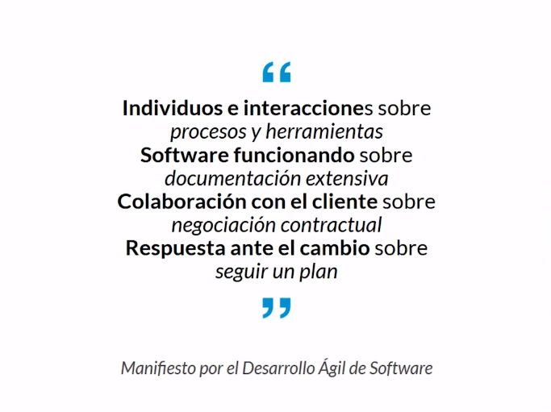
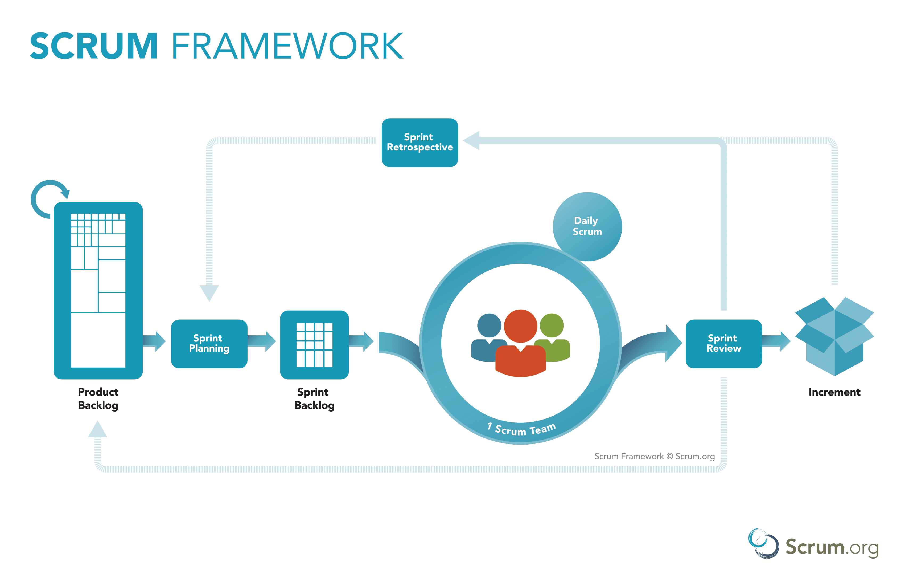
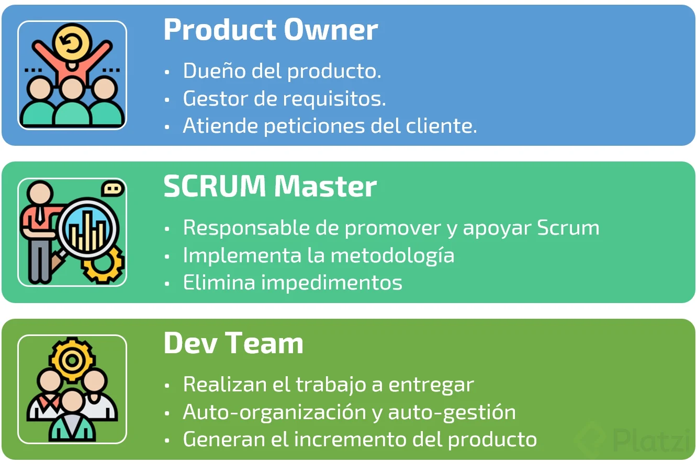
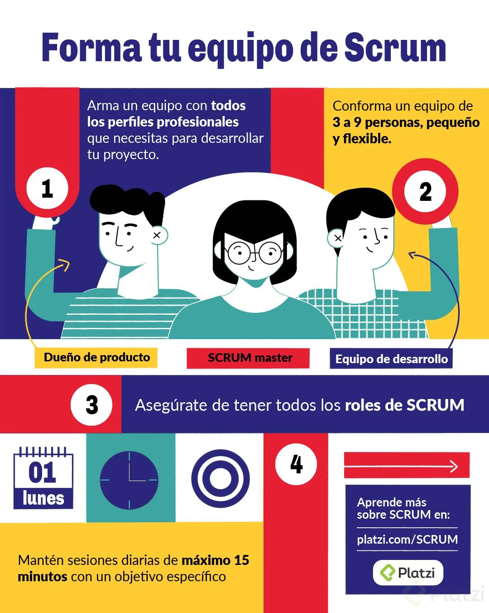
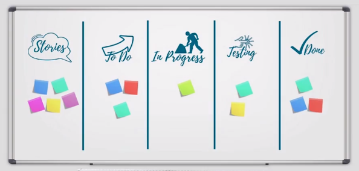
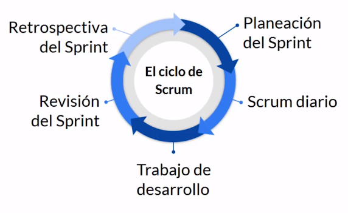
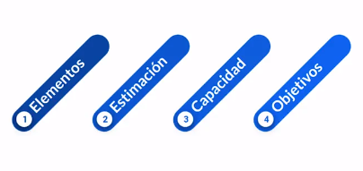
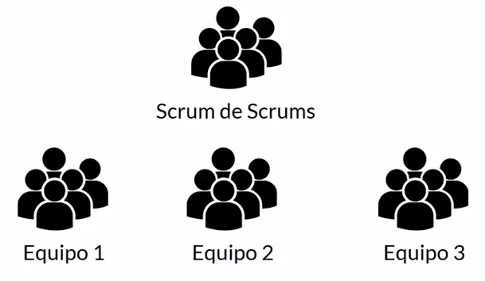

# SCRUM 💻✔<!-- omit in toc -->

@[ManuelDevWeb](https://github.com/ManuelDevWeb "ManuelDevWeb") @[Platzi](https://platzi.com/clases/scrum/ "Platzi") 💚

## ¿Qué es una metodología ágil?

**¿Qué es Agile?**
Crear productos, responder al cambio, entregas continuas.

**Mentalidad (Manifiesto ágil)**
Ganar experiencia y generar calidad en el producto a través del tiempo, es decir mientras estamos desarrollando.

**Diferencias entre desarrollo tradicional y ágil**

1. **Grupos de trabajo**

- **Tradicional**: Grupos grandes de trabajo, puede generar dificultades como saber quién está trabajando en qué.
- **Agil**: Equipos de trabajo más pequeños con un tiempo de desarrollo corto ejemplo: 2 semanas (1 iteración).

2. **Requerimientos**

- **Tradicional**: Grandes listas de requerimientos.
- **Agil**: Pequeñas listas de requerimientos que vamos a trabajar durante la iteración.

3. **Generación de valor**

- **Tradicional**: Trabajar toda la lista de requerimientos y al final mostrar al cliente con lo que creemos es el producto terminado.
- **Agil**: Entregar los pequeños avances al cliente cada iteración para que pueda ver los cambios en el producto poco a poco.

## Principios ágiles

Promueven el desarrollo sostenido.

  

1. **Satisfacción al cliente**: Entrega continuar de software con valor.
1. **Cambios**: Los cambios son bienvenidos en cualquier etapa del proyecto.
1. **Software funcional**: Software que pueda ser usado por el cliente y en periodos cortos de tiempo.
1. **Colaboración**: Forma en la que interactuas y te comunicas con el cliente o equipo de trabajo.
1. **Individuos motivados**: Dar un buen entorno y confianza al equipo de desarrollo.
1. **Comunicación cara a cara**: Método mas eficiente, estar con el cliente y leer su lenguaje corporal.
1. **Progreso**: El software funcionando es la medida principal de progreso.
1. **Desarrollo sostenible**: El ritmo de desarrollo debe ser constante de forma indefinida.
1. **Mejora continua**: Gracias a que las metodologías ágiles son iterativas, se puede ver que se hizo bien y que se puede mejorar para la próxima iteración.
1. **Simplicidad**: Priorizar y hacer el trabajo que esta bien definido en ese preciso momento.
1. **Auto-organización**: El equipo debe ser capaz de tomar sus propias decisiones.
1. **Auto-evaluación**: El equipo debe ser capaz de ajustar y perfeccionar su comportamiento para mejorar.

## SCRUM

Es un marco de trabajo por el cual las personas pueden abordar problemas complejos adaptativos, a la vez que entregan productos del máximo valor posible productiva y creativamente.

Todo el equipo colabora para lograr un objetivo.

**Esencia**

- Pequeño equipo de personas.
- El equipo individual es altamente flexible y adaptativo.

**Teoría**
Scrum se basa en la teoría del empirismo, el cual asegura que el conocimiento procede de la experiencia y de tomar decisiones basándose en lo que se conoce.

**Pilares**

1. **Transparencia**: Cualquier persona involucrada en el proyecto pueda saber el estado actual del proyecto.
1. **Inspección**: Los artefactos son lo que conocemos como requerimientos. Cualquier persona puede observar estos artefactos y analizar si están bien definidos o no.
1. **Adaptación**: La capacidad que tiene cualquier persona en el proceso de reconocer cambios y poderlos implementar lo más rápido.

**Valores**

- Compromiso
- Coraje
- Enfoque
- Apertura
- Respeto

## Componentes de SCRUM

  

- **Equipo de Scrum**: El equipo de Scrum es auto organizado y multifuncional.

  - **Dueño del producto (Product Owner)**: Responsable de maximizar el valor del producto.
  - **Scrum Master**: Responsable de promover y apoyar Scrum, está a cargo de los procesos de desarrollo.
  - **Equipo de desarrollo (Development Team)**: Profesionales que realizan el trabajo de entregar un incremento de producto con valor.

- **Eventos de Scrum**: En Scrum existen eventos predefinidos con el fin de crear regularidad y minimizar la necesidad de reuniones no definidas en Scrum.

  - **Sprint**: Es el corazón de Scrum donde se crea un incremento del producto.
  - **Planificación de Sprint (Sprint planning)**: Ceremonia para definir qué se hará durante el sprint.
  - **Scrum Diario (Daily stan-up)**: Reunión diaria de todo el equipo de desarrollo.
  - **Revisión de Sprint (Sprint review)**: Es donde se muestra el incremento desarrollado durante el sprint.
  - **Retrospectiva de Sprint (Sprint retrospective)**: Oportunidad para aplicar mejora continua.

- **Artefactos de Scrum**: Son aquellos elementos que definen que quiere el cliente, pero son visibles para todas las personas que trabajan en el proyecto.
  - **Lista del producto (Product Backlog)**: Es una lista ordenada de todo lo que se conoce que es necesario en el producto.
  - **Lista de pendientes del Sprint (Sprint Backlog)**: Elementos de la lista de producto seleccionados para trabajar durante el sprint.

## El equipo SCRUM

  

SCRUM a maximizado al equipo para optimizar la flexibilidad, creatividad y productividad, para lograr llegar a un objetivo, con el fin de que ocurran tres cosas:

1. Entregar producto de forma iterativa
1. Que sea incremental.
1. Maximizar la interacción y retroalimentación con el cliente.

El equipo de scrum debe evitar dependencias externas y organizarse en base a funcionalidades o componentes.

**Forma tu equipo de SCRUM**

  

## Product Owner (Dueño del Producto)

Es el único encargado de la lista del producto, decide que se va a trabajar primero, encargado de despejar dudas al equipo de desarrollo de como el cliente desea el producto de forma detallada.

**Responsabilidades**

- Capacidad de explicar en que consiste cada funcionalidad.
- Decidir en que orden se van a realizar los diferentes desarrollos o funcionalidades.
- Dar claridad en los objetivos del desarrollo.
- Saber cuales tareas sean realizado y cuales faltan, y mostrar hacia donde van.
- Asegurar que el equipo de desarrollo conoce los elementos de la lista del producto.

**Características**

- Maximiza valor del producto.
- Gestiona backlog.
- Unica persona autorizada para modificar la lista del producto.

### Scrum Master

Es el responsable de promover y apoyar scrum dentro del equipo, ayudando a todos a entender la teoría, práctica, reglas y valores de Scrum. Si hay algo que no se está haciendo bien debe decirnos "podemos mejorar".

Importante que sea un líder que está al servicio del equipo scrum, y es el encargado de ayudar a entender a los externos al equipo scrum cuando deben interactuar con el equipo.

**¿Cómo ayuda al Product Owner?**

- Asegurar que los objetivos y el alcance sean entendidos por todo el equipo scrum, que todos entiendan en el planning qué se va a trabajar.
- Entender y practicar la agilidad.
- Facilitar los eventos de scrum según se requiera o necesite, planeación de lugar, fecha, hora, recursos, que cuando el equipo llegue a la sala esté todo lo que el equipo necesite.

**¿Cómo ayuda al Development Team?**

- Guiar al equipo de desarrollo para que sea autoorganizado, darle liderezgo a alguien para que resuelvan cualquier duda o inconveniente.
- Ayudar al equipo de desarrollo a crear productos de alto valor, asegurándose que los objetivos durante el sprint sean entendidos.
- Eliminar impedimentos para el progreso del equipo de desarrollo.

**¿Cómo ayuda a la organización?**

- Liderar y guiar a la organización a la adopción de Scrum.
- Trabajar en conjunto con otros SMs para incrementar la efectividad de la aplicación de Scrum en la organización.

### Development Team (Equipo de Desarrollo)

Consiste en un grupo de profesionales que realizan el trabajo de entregar un incremento de producto "Terminado" que potencialmente se pueda poner en producción al final de cada sprint.

La organización debe poder empoderar al Dev team para que estos se organicen y gestionen su propio trabajo. Deben darles la confianza al equipo.

**Características**

- Auto-organizados.
- Multifuncionales.
- No tienen títulos.
- No hay subequipos.
- Solo se puede modificar el equipo al terminar el sprint.

El equipo puede ser de 3 a 9 personas sin tomar en cuenta el product owner y al scrum master. Al menos que uno de esos dos hagan código o diseño y que este dentro de sus funciones diarias hacer esta actividades.

### Las Epicas y Backlog del Producto

- Lista ordenada que representa todo lo que el cliente quiere en su producto. Los cambios deben ser incluidos en esta lista.
- Los elementos mas prioritarios deben estar super detallados, y estos elementos son los que están en el sprint actual y el próximo. Los sprint lejanos no es necesario tenerlos tan detallados por el momento.
- Las lista es dinámica, cambia constantemente para identificar lo que el producto necesita para ser adecuado, competitivo y útil.
- Es un artefacto vivo cosas pueden agregarse o eliminarse del producto.
- Los elementos del producto los conocemos como Historias de Usuario.
- Esta se completan a medida que avanza el proyecto , según los nuevos requerimientos.
- Las Épicas son el conjunto de muchas historias de usuarios y nacen de la toma de notas de funcionalidades o módulos. Estas épicas requieren de más de un sprint para ser completadas.

### ¿Qué nos cuentas las Historias de Usuario?

**¿Qué son las historias de usuario?**
Las historias de usuario son los elementos más específicos del backlog, contiene la visión del usuario sobre la funcionalidad esperada del producto.

**Componentes de la Historia de Usuario**

- **Titulo:** ¿De qué se trata la tarea?
- **Descripción:** ¿Cómo se deben realizar las historias?
  - **Como:** Rol
  - **Quiero**: Acción
  - **Para**: Beneficio
- **Puntos:** Esfuerzo que le va a tomar al equipo de desarrollo terminar una tarea.
- **Criterios de aceptación:** ¿Cómo identificamos que la tarea fue completada?

Dentro la definición de historia de usuario vamos a entender como completo, cuando por ejemplo:

- Funcionalidad, cumple con lo establecido en la historia.
- Código subido a git.
- Pruebas creadas.
- Documentación.

**Invirtiendo en Historias**
Las tres C's

- Cards (Tarjetas): Escribimos la historia de usuario.
- Conversación: Entender todo sobre la historia.
- Confirmación: Confirmar que todos entendieron lo mismo.

**Las historias de usuario se caracterizan por**

- **I** Independiente, no debe depender de otra historia de usuario.
- **N** Negociable. si la historia es muy grande dividirla en tareas pequeñas.
- **V** Valiosa, Debe entregar valor al cliente.
- **E** Estimable, cuánto esfuerzo requiere.
- **S** Small, debe ser pequeña.
- **T** Testable, se debe validar su funcionalidad.

## Estimas historias de usuario

Para poder estimar historias de usuario tenemos que tener en cuenta

- Complejidad de la historia
- Cantidad de trabajo requerido
- Conocimientos necesarios
- Incertidumbre

El estimado lo vamos a tomar como puntos, los puntos no son horas de trabajo, no commits, etc es un estimado empírico en base a la experiencia del proyecto.

**Poker de planeación**
Esta herramienta nos va a servir para estimar las historias de usuarios. Podemos usar diferentes escalas.

- **Fibonacci:** (0, 1, 2, 3, 5, 8, 13, 21, 34, 55, ?)
- **Fibonacci modificado:** (0, 1/2, 1, 2, 3, 5, 8, 13, 20, 40, ?)
- **Potencia de 2:** (1, 2, 4, 8, 16, 32, 64, ?)

- **Velocidad:** Total de puntos de las HU completadas por el equipo durante un sprint.
- **Capacidad:** Total de HU que se pueden completar en un sprint futuro.

https://planningpokeronline.com/

## ¿Por dónde comenzar? Prioridades y Backlog del Sprint

El backlog del sprint va a ser un subconjunto de elementos de la lista del producto y estas historias de usuario son las que vamos a trabajar y los objetivos que queremos cumplir.

**Lista de pendientes del Sprint**

  

Debe estar lo suficientemente detallado para que el equipo sea capaz de comprenderlo en los daily stand-ups

El dueño del backlog del sprint es el equipo de desarrollo, y ellos tienen control sobre esta lista y están en su derecho de rechazar otras historias. Sin embargo el Product owner podrá dialogar con el equipo para bajar la prioridad o eliminar historias de usuarios

**¿Cómo se define las prioridades?**

- Valor para el cliente, que historias generan más valor al producto.
- Urgencia, cuando algo tiene una fecha limite.
- Riesgo / Oportunidad, definir el impacto que una historia puede tener sobre otras.
- Esfuerzo que tanto trabajo le va a tomar al equipo desarrollar la historia.

## Midiendo el avance del proyecto

En cualquier momento del Sprint el equipo puede analizar el progreso hecho y revisar si aún se puede cumplir el objetivo planeado al inicio de la iteración. Con base a los puntos de la historia.

- **Burn down chart:** Un gráfico de trabajo pendiente a lo largo del tiempo, muestra la velocidad a la que se estan completando los objetivos. Permite extrapolar si el equipo podrá completarel trabajo en el tiempo estimado. Usualmente el trabajo remanente (backlog) se muestra en el eje vertical y el tiempo en el eje horizontal. Muy util para realizar adaptaciones entre los sprints.
- **Burn up chart:** Muestra el trabajo aportado por el equipo a un proyecto agíl. Util para gestionar el trabajo porque permite tomar decisiones realistas acerca del trabajo pendiente y las expectativas del mismo. Ayuda a encontrar el ritmo sostenible del equipo. Además cuando la velocidad de éste se estabiliza (normalmenteal cabo de 4-5 sprints), podemos hacer un cálculo de cúando podría acabarse el proyecto.
- **Diagrama de flujo acumulado:** Proporciona una visualizacion concisa de las metricas de flujo. Muestra que tan estable es tu flujo y te ayuda a entender dónde concentrarse para hacer que tu proceso sea más predecible.

_Observar las tablas del excel._

## ¿Cuál es el ritmo del equipo? El Sprint

Es el corazón de Scrum, es un período de tiempo determinado (1-4 semanas) en que se crea un incremento del producto.

  

- **Planeación**: Que se va a trabajar.
- **Scrum diario:** Reunión para discutir el progreso.
- **Trabajo de desarrollo:** Que va ocurriendo todos los días.
- **Revisión del sprint:** Aquí vemos si se cumplen o no los objetivos.
- **Retrospectiva:** Que se puede mejorar.

Todos los sprints deben de tener un objetivo claro y el equipo de desarrollo lo debe saber porque lo esta haciendo. Si los objetivos quedan obsoletos el product owner puede cancelar el sprint y esto rara vez sucede

## Planeando el Sprint

**¿Qúe es el Planning?.**
El sprint planning es la ceremonia donde definimos las histotias de usuario que se van a desarrollar durante el sprint. Debe estar presente todo el equipo de Scrum: SM, PO y equipo de desarrollo.

**¿Qué duración debe tener el planning?.**
No debe durar más de 8 horas para sprints de 4 semanas. Normalmente esta ceremonia puede durar 1 hora para un sprint de 2 semanas.

**Funciones del Scrum Master en el Planning.**
Es el encargado de organizar esta ceremonia, debe ser en un lugar adecuado, un salón lo suficientemente grande para el equipo, puede haber pizarrón, si se necesita sala de videoconferencia para hablar con un cliente. El Scrum Master debe encargarse de que todo esté y que todo funcione.

Nadie puede responder correos, llamadas, ni mensajes, deben estar concentrados en el srpint planning, y todo el equipo debe estar concentrado en la misma actividad.

**Objetivos del Planning**

- **¿Qué puede entregarse al final del sprint?**

  - Se toman las HU más prioritarias de la lista de producto.
  - Se discute también el objetivo a lograr en el sprint.
  - Saber la capacidad del equipo y la velocidad de la última iteración.

- **¿Cómo se logrará hacer este trabajo?**
  - Las HU pasan de la lista de producto al backlog del srpint.
  - Se hacen las estimaciones de esfuerzo.
  - El PO se encarga de aclarar cualquier duda con una HU.
  - Pueden haber invitados que aporten valor (cliente, usuario final).

  

## Daily stand-up (El seguimiento del proyecto)

- Es una reunión diaria de no más de 15 minutos, donde participa el equipo de desarrollo y debe ser en pie con la finalidad de no extenderse.
- Se utiliza para planear las próximas 24 horas de trabajo.
- El scrum master es responsable de organizar la reunión, de preferencia a la misma hora para crear la costumbre.
- Otras personas pueden estar presentes pero no participar. Esta reunión se hace con la finalidad de optimizar la colaboración del proyecto.
- En esta ceremonia cada miembro debe responder 3 preguntas.
  - ¿Qué hice ayer?
  - ¿Qué haré hoy?
  - ¿Tengo algún impedimiento?
- Si existen impedimentos, el SM es el encargado de ayudar a resolver ese impedimento. Normalmente estos impedimentos tienen que ver con equipos externos.
- Si se necesitan más detalles se pueden realizar reuniones adicionales de ser necesarios para resolver alguna duda.

## Refinando historias

Dentro de los procesos de Scrum es altamente deseado siempre tener funcionalidad en el Backlog para que esté listo para la implementación.

Estas sesiones pueden ocurrir al menos una vez durante el sprint, donde todo el equipo de Scrum puede participar. El objetivo de la sesión de refinamiento son

- Detectar cualquier duda o impedimento.
- Si hay algún tipo de dependencia.
- Que el QA o Dev, sepan que deben probar o programar.

## Mostrando y Aprendiendo: Demos y retrospectivas

**Sprint Review.**
Es una ceremonia donde interactuamos con el cliente, el objetivo es tener retroalimentación rápida, normalmente se hace en el último día del sprint y revisaremos que hemos aprendido , le mostraremos al cliente que logramos desarrollar, se puede mostrar por partes durante la semana o todo al final del sprint. Ojo aquí no mostramos presentaciones o documentos, aquí solo se muestra el producto.

Si no se logran cumplir los objetivos, tenemos que ser siempre transparentes y tratar de resolverlo par el siguiente sprint. Es una reunión informal y abierta al diálogo, no es una reunión de seguimiento.

El Scrum Master es responsable de programar la reunión, al final de la reunión vamos a tener una lista de producto actualizada.

Después del sprint review viene una retrospectiva, donde el equipo de scrum analiza las oportunidades de mejora, no buscamos culpables, buscar de forma positiva como se puede mejorar

**Retrospectiva**

- **Herramientas:** Tenemos todo lo necesario para cumplir nuestro objetivo.
- **Relaciones:** Son fluidas o hay problemas.
- **Personas:** Cómo es la interacción.
- **Procesos:** Todavía se ajustan al desarrollo.

**Preguntarse**

- ¿Qué hicimos bien?
- ¿Qué no hicimos tan bien?
- ¿Qué podemos mejorar?

En base a estas respuestas vamos a hacer un plan de acción para aplicar las correcciones necesarias a nuestros procesos.

## Escalabilidad de Equipos

Scrum es capaz de funcionar con proyectos de 10 personas como proyectos de 100 y más. La forma en como está diseñado Scrum permite enfrentar proyectos de distintos niveles de complejidad.

  

Scrum of Scrums es una reunión donde frecuentemente se encuentran miembros de todos los equipos y que permite coordinar esfuerzos entre los dintintos equipos de la organización.

## La importancia de las comunidades de práctica

Son grupos de personas que comparten un interés o una pasión por algo que hacen y aprenden a hacerlo mejor a medida que van interactuando.

El objetivo es aprender y buscar mejorar

- **Dominio:** Que nos gusta.
- **Práctica:** Como lo compartimos.
- **Comunidad:** A quién más le interesa.

Las comunidades se pueden dividir en

- **Basada en roles**: Enfocado a la especialización.
- **Basada en tópicos:** Enfocado a crear una comunidad sin importar el rol.

> “Existe una clara forma de comenzar tu camino con Scrum: sigue todas las reglas desde el primer día sin cuestionarlas. El motorcito va a hacer su trabajo, iluminando el camino que tenemos por delante.”
